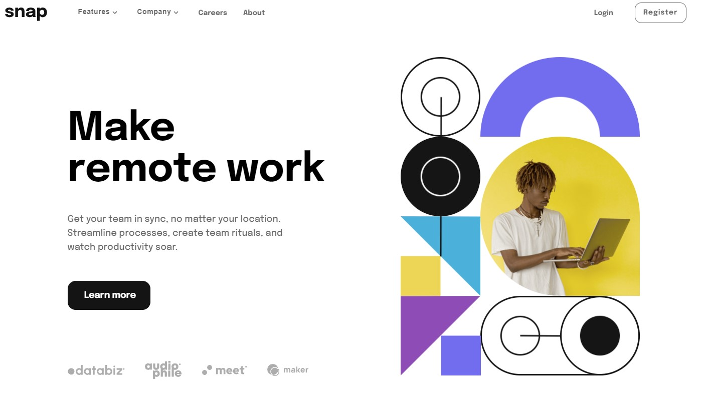

# Frontend Mentor - Intro section with dropdown navigation solution

This is a solution to the [Intro section with dropdown navigation challenge on Frontend Mentor](https://www.frontendmentor.io/challenges/intro-section-with-dropdown-navigation-ryaPetHE5). Frontend Mentor challenges help you improve your coding skills by building realistic projects.

## Table of contents

- [Overview](#overview)
  - [The challenge](#the-challenge)
  - [Screenshot](#screenshot)
  - [Links](#links)
- [My process](#my-process)
  - [Built with](#built-with)
  - [Useful resources](#useful-resources)
- [Author](#author)

**Note: Delete this note and update the table of contents based on what sections you keep.**

## Overview

### The challenge

Users should be able to:

- View the relevant dropdown menus on desktop and mobile when interacting with the navigation links
- View the optimal layout for the content depending on their device's screen size
- See hover states for all interactive elements on the page

### Screenshot

### Links

- Solution URL: [Github](https://github.com/denis-farkas/intro-section-with-dropdown-navigation-main)
- Live Site URL: [Vercel](https://intro-section-with-dropdown-navigation-main-hstqpjq3j.vercel.app/)

## My process

### Built with

- Semantic HTML5 markup
- CSS custom properties
- Flexbox
- Desktop-first workflow
- Javascript

### Useful ressources

- [collapse sidebar](https://www.w3schools.com/howto/tryit.asp?filename=tryhow_js_collapse_sidebar) - This helped me.

## Author

- Website - [Portfolio](https://denis-farkas.students-laplateforme.io/)
- Frontend Mentor - [@denis-farkas](https://www.frontendmentor.io/profile/denis-farkas)
